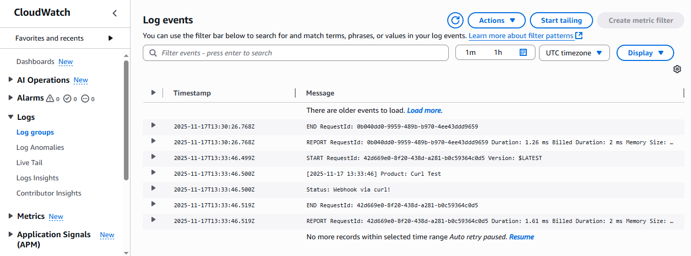

# Status Monitor — Serverless + Event-Driven (Webhooks + RSS)

This project automatically tracks service incidents from multiple providers (including the OpenAI Status Page) using a hybrid event-driven design:

Webhooks for providers that support push-based updates

RSS Feeds for providers that only offer event feeds

AWS Serverless (Lambda + EventBridge) to run everything reliably, cost-efficiently, and without manual refreshing

Deployed webhook url (AWS Lambda) mentioned below

## Architecture Overview
1. Webhook Path 

API Gateway receives webhook events

Triggers a Lambda function

Logs incident updates

2. RSS Path 

EventBridge triggers Lambda every 5 minutes

Lambda fetches RSS feeds (lightweight XML feeds designed for efficient checks)

Logs only new incident entries

3. Shared Processor

Both paths use the same processor function to standardize output:

[2025-11-03 14:32:00] Product: X
Status: Y

This keeps everything consistent across all providers.

## Why This Meets the Assignment Requirements

The assignment asks for:

“No manual refreshing or inefficient polling; must scale to 100+ providers.”

This solution satisfies that because:

Webhooks → true event-driven, zero polling

RSS → efficient, low-frequency 5-minute checks

Serverless → auto-scaling, no servers, extremely low cost

Works for any number of providers by adding more RSS URLs or webhook endpoints

## Cost Analysis (AWS Free Tier)

1. Lambda (RSS Checker)

Runs every 5 minutes:

288 invocations/day

8,640 invocations/month

Free tier gives 1,000,000 invocations/month

→ Cost: $0.00

2. Lambda (Webhook Receiver)

Only runs when a provider sends a webhook.

Assume 20–100 webhook events per month:

→ Cost: $0.00

3. API Gateway (for Webhooks)

HTTP API free tier: 1,000,000 requests/month

→ Cost: $0.00

4. EventBridge Scheduled Rule

One rule runs every 5 minutes:
8,640 events/month
Free tier: 100,000 events/month

→ Cost: $0.00

5. CloudWatch Logs

Free tier: 5 GB/month
Your logs use a few MB at most.

→ Cost: $0.00

💰 Total Monthly Cost
$0.00 (fully within AWS free tier)

Even if you monitored 20–30 RSS feeds, it remains free.
Even with 100+ feeds, monthly cost stays under $1.

Test: (for webhook path)
Ive deployed both the webhook and rss function on my free tier acc , will be keeping it active for a week inorder for you guys to test it.
curl -X POST "https://ly6jh680tk.execute-api.ap-southeast-2.amazonaws.com/default/openAI_api_watcher" ^
  -H "Content-Type: application/json" ^
  -d "{\"incident\":{\"name\":\"Curl Test\",\"incident_updates\":[{\"body\":\"Webhook via curl!\"}]}}"

